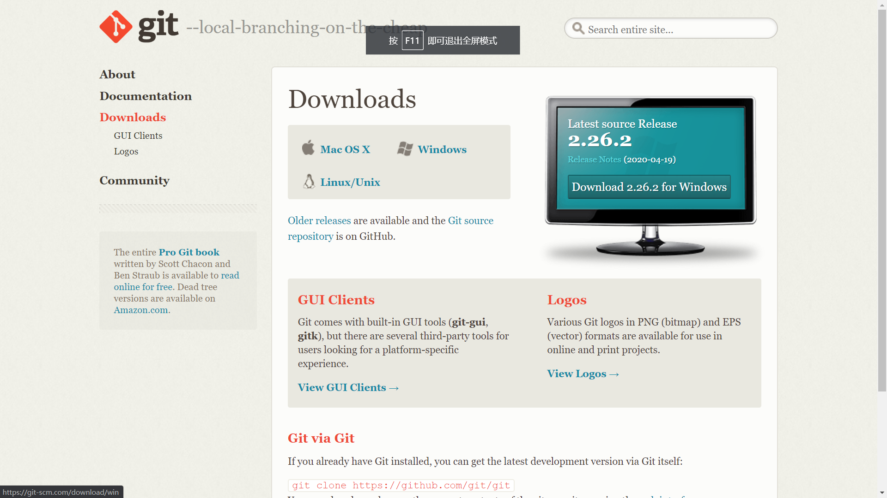
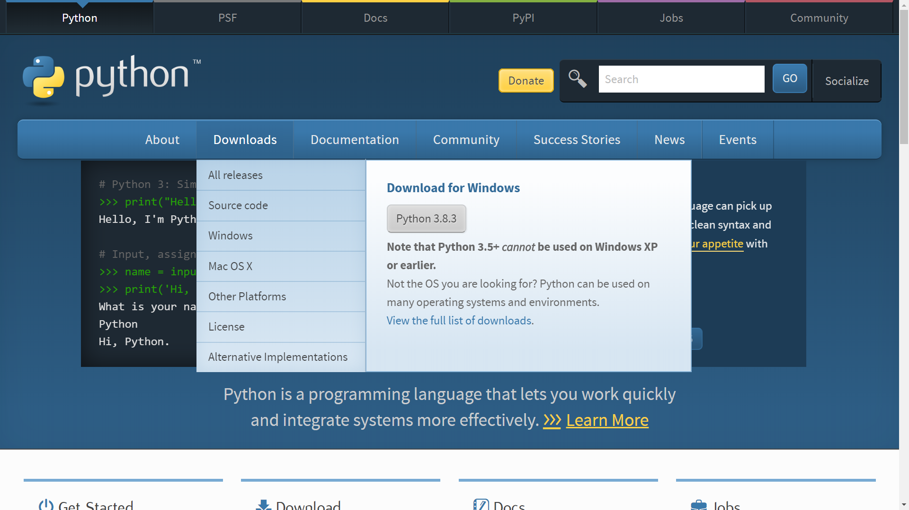
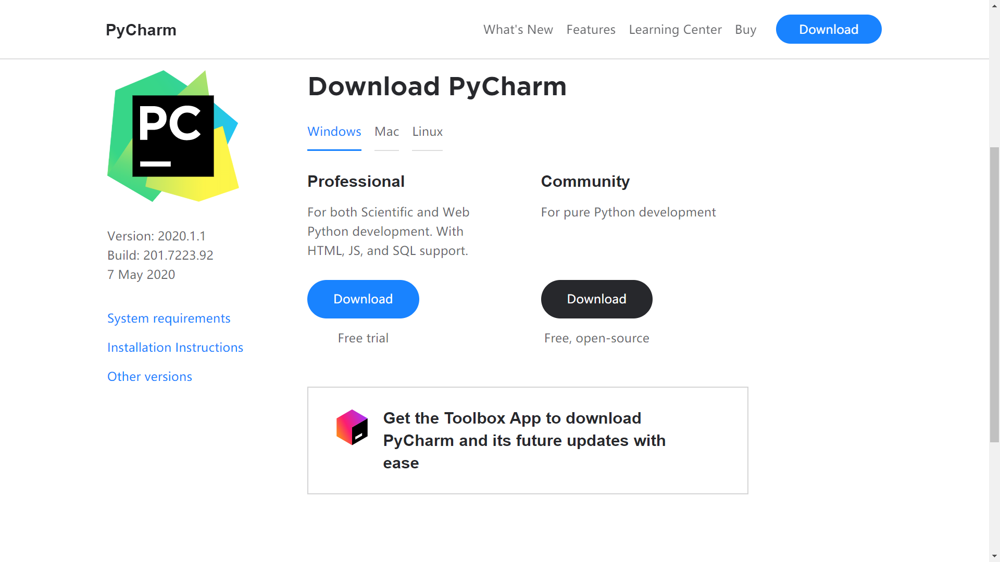
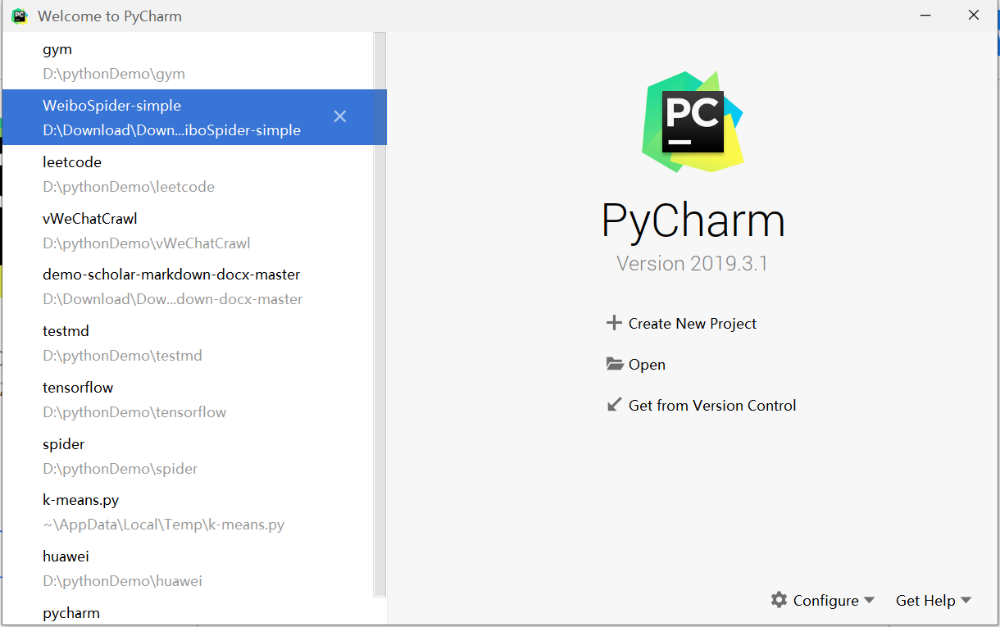

# gym
***
##Introduction to gym
Gym是用于开发和比较强化学习算法的工具包。 它支持让agents学习行走，也能让agents学习玩诸如Pong或Pinball之类的游戏  
它是用于强化学习任务的开源接口，提供了一套易于使用的强化学习任务。
Gym提供环境,我们自己编写算法，编写算法时可以使用现有的数值计算库（例如TensorFlow)编写。  
网址[gym.openai.com](https://gym.openai.com/) 
***
###documentation
网址：https://gym.openai.com/docs/
###Preparatory work
python,python编辑器pycharm,版本控制工具git  

注意选择你的电脑对应的版本，pycharm选择Community即可，同学们可以通过复旦邮箱使用Professional版本，同学们可以自行去探索  

git网址：https://git-scm.com/downloads
 
下载电脑操作系统对应的版本  
python网址 ：https://www.python.org/
   
pycharm网址:https://www.jetbrains.com/pycharm/download/#section=windows
选择你电脑对应的操作系统，建议选择Community版本
   
    
###从github中clone本项目
git from version control
  
点击git from version control 并填写地址：https://github.com/virtual-world-2020/gym

这样本项目就导入到本地了。


                         
####Installation
需要Python 3.5+ 
```shell script
pip install gym
```
###hello world
```python
import gym
env = gym.make('CartPole-v0')
env.reset()
for _ in range(1000):
    env.render()
    env.step(env.action_space.sample()) # take a random action
env.close()
    
```
###强化学习
参考：https://morvanzhou.github.io/tutorials/machine-learning/reinforcement-learning/  
强化学习是机器学习大家族中的一大类, 是让计算机实现从一开始什么都不懂, 脑袋里没有一点想法, 通过不断地尝试, 从错误中学习, 最后找到规律, 学会了达到目的的方法. 这就是一个完整的强化学习过程.   
实际中的强化学习例子有很多. 比如近期最有名的 Alpha go, 机器头一次在围棋场上战胜人类高手, 让计算机自己学着玩经典游戏 Atari, 这些都是让计算机在不断的尝试中更新自己的行为准则, 从而一步步学会如何下好围棋, 如何操控游戏得到高分.

###Q learning
   

