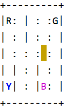

# gym
***
## Introduction to gym
* Gym是用于开发和比较强化学习算法的工具包。 它支持让agents学习行走，也能让agents学习玩诸如Pong或Pinball之类的游戏  
它是用于强化学习任务的开源接口，提供了一套易于使用的强化学习任务。
* Gym提供环境,我们自己编写算法，编写算法时可以使用现有的数值计算库（例如TensorFlow)编写。  
* 网址[gym.openai.com](https://gym.openai.com/) 
***
### documentation
* 网址：https://gym.openai.com/docs/
### Preparatory work
* python  
网址 ：https://www.python.org/
* python编辑器pycharm  
网址: https://www.jetbrains.com/pycharm/download/#section=windows  
* 版本控制工具git  
网址：https://git-scm.com/downloads   
* 注意选择你的电脑对应的版本，pycharm选择Community即可，同学们可以通过复旦邮箱使用Professional版本，同学们可以自行去探索  
###从github中clone本项目
* git from version control
完成上一步后，打开pycharm,点击git from version control 并填写地址：https://github.com/virtual-world-2020/gym
* 这样本项目就导入到本地了。
              
#### Installation of gym

```shell script
pip install gym
```
### hello world
见testGym.py
```python
import gym
env = gym.make('CartPole-v0')
env.reset()
for _ in range(1000):
    env.render()
    state, reward, done, info=env.step(env.action_space.sample()) # take a random action
    if done:#结束了就从头再来
        env.reset()
env.close()
```
* 这算是gym的hello world程序，程序中，我们创建了gym 中名为'CartPole-v0'的环境，这样的环境还有很多，同学们可以在官方文档中查阅，强烈建议有兴趣的同学去阅读官方文档自行探索，本文档仅作指导作用。
* 由于我们还没有编写自己的算法，环境中执行动作时采用了随机动作。
### gym 中的重要概念
* 参考： https://gym.openai.com/docs/
* Environments   
hello world 示例中展示了'CartPole-v0' 这个环境,通过“env = gym.make('X')”,创建不同的环境。
* Observations  
如果不想采用随机动作，而是根据掌握的当前环境的信息采取决定，那就需要Observations,环境的step方法恰好返回了我们所需要的Observations,step返回四个值。这些是：  
    - observation（object）：特定于环境的对象，代表您对环境的观察。
    - reward（float）：上一动作获得的奖励。
    - done（boolean）：是否需要reset再次进入环境，即该回合是否该结束了。
    - info（dict）：对调试有用的诊断信息。
* Spaces  
每个环境都带有action_space和observation_space，它们描述了有效操作和观察的范围。

### 强化学习
参考：https://morvanzhou.github.io/tutorials/machine-learning/reinforcement-learning/  
强化学习是机器学习大家族中的一大类, 是让计算机实现从一开始什么都不懂, 脑袋里没有一点想法, 通过不断地尝试, 从错误中学习, 最后找到规律, 学会了达到目的的方法. 这就是一个完整的强化学习过程.   
实际中的强化学习例子有很多. 比如近期最有名的 Alpha go, 机器头一次在围棋场上战胜人类高手, 让计算机自己学着玩经典游戏 Atari, 这些都是让计算机在不断的尝试中更新自己的行为准则, 从而一步步学会如何下好围棋, 如何操控游戏得到高分.

### Q learning
### Taxi-v3
* Document:  
https://gym.openai.com/envs/Taxi-v3/  
* Github:   
https://github.com/openai/gym/blob/master/gym/envs/toy_text/taxi.py  
* Description:  
在Map中有四个指定的位置，分别是R(ed)、G(reen)、Y(ellow)和B(lue)。当一回合开始时，出租车在广场中一个随机位置出发，乘客在RGYB中的一个随机的位置。出租车开到乘客的位置，接乘客，运送乘客到目的地(RGYB中的另一个)，然后放下乘客。一旦乘客下车，这一回合就结束了
* Map
```shell script
MAP = [
    "+---------+",
    "|R: | : :G|",
    "| : | : : |",
    "| : : : : |",
    "| | : | : |",
    "|Y| : |B: |",
    "+---------+",
]
```
* 彩图及含义:   
      
|  颜色   | 含义  |
|  ----  | ----  |
| 蓝色  | 乘客 |
| 洋红色  | 目的地 |
| 黄色 | 空出租车 |
| 绿色  | 载客出租车 |  

  
* Observations:  
有500个离散状态，因为有25个出租车位置，乘客的5个可能位置(包括乘客在出租车中的情况)，和4个目的地位置。
* Actions:任何时刻，出租车都有六种行为  
    - move south
    - move north
    - move east 
    - move west 
    - pickup passenger
    - dropoff passenger

* Rewards:  
每一次行动都有-1的奖励，而运送乘客成功到达目的地则有+20的额外奖励。出租车仅能在乘客的位置执行“pickup”,仅能在目的地执行“dropoff”,非法执行“pickup”和“dropoff”的行为将得到-10的奖励。


### 案例
#####  1. 随机状态下
见 random_taxi.py
#####  2. 使用Q learning 训练后
见 testTaxi-v3.py, 运行程序需要安装numpy
```shell script
pip install numpy
```
   

